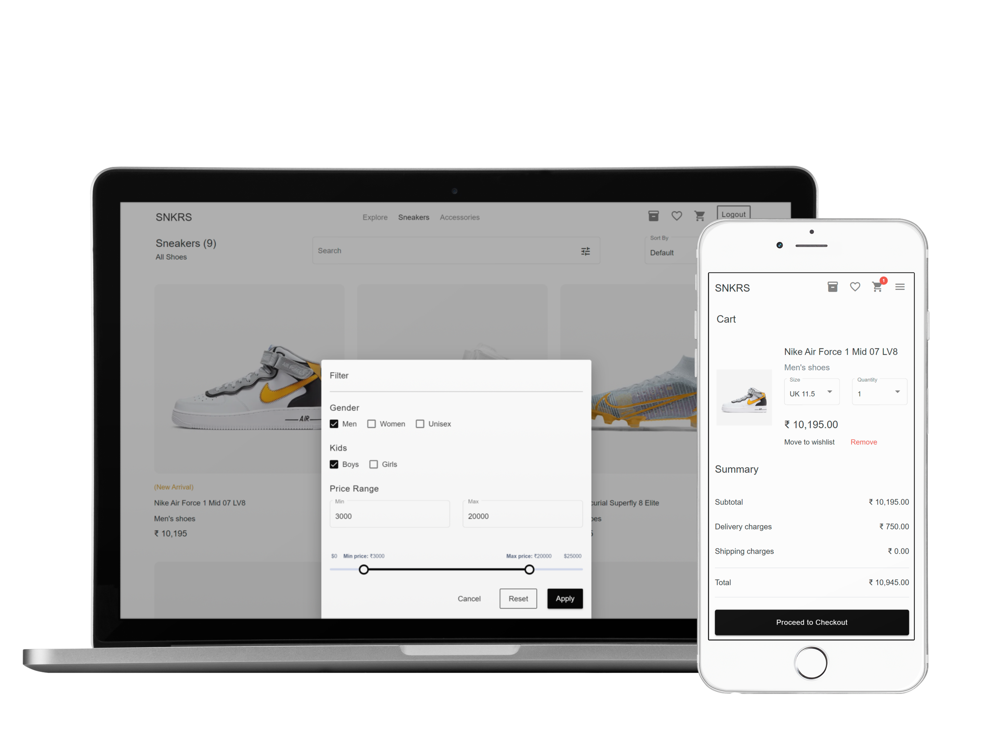

# SNKRS

## Table of Contents
- [Introduction](#introduction)
- [Features](#features)
- [Design](#design)
- [Getting Started](#getting-started)
  - [Prerequisites](#prerequisites)
  - [Installation](#installation)
- [Build](#build)
- [Contributors](#contributors)
- [Contributing](#contributing)
- [License](#license)
- [Acknowledgements](#acknowledgements)

## Introduction

SNKRS is an online e-commerce web application for browsing and buying sneakers
A cross platform progressive e-commerce web application for purchasing sneakers. Users can view, search and filter from a wide range of sneakers to find the sneaker of their choice. LoggedIn users can review, wishlist, buy and track their orders. From browsing to checkout this application delivers the best in class user experience.

## Features

The SNKRS application offers the following features:

- **Cross-Platform**: Progressive web application (PWA) accessible across devices.
- **Browsing and Shopping**: Users can browse a diverse catalog of sneakers.
- **Search and Filtering**: Enables users to search for specific sneakers and apply filters.
- **User Authentication**: Secure login and registration functionality.
- **User Interaction**: Logged-in users can add reviews, wishlist items, purchase sneakers, and track their orders.
- **Checkout Process**: Smooth and intuitive checkout experience for completing purchases.
- **Responsive Design**: Ensures usability and functionality across various screen sizes.
- **Performance**: Optimized for speed and efficiency, providing a seamless user experience.
- **Accessibility**: Designed to be accessible to users with disabilities.
- **Security**: Implements best practices to safeguard user data and transactions.


## Design

*SNKRS  GUI*

## Getting Started

### Prerequisites

Make sure you have Node and Yarn installed on your system. If not, download and install it from [nodejs.org](https://nodejs.org/en) [yarnpkg.com](https://classic.yarnpkg.com/en/).

### Installation

First, install the dependencies of SNKRS:

```bash
yarn install
```

Second, run the development server using one of the following commands:

```bash
npm start
```

## Build
To generate the build.
```bash
ng build --aot --prod
```
## Contributors

- [Huzaifa Anjum](https://github.com/mhuzaifa)

## Contributing

We welcome contributions! If you would like to contribute to SNKRS, please read our [contribution guidelines](CONTRIBUTING.md).

## License

This project is licensed under the [MIT License](LICENSE). See the [LICENSE](LICENSE) file for details.

## Acknowledgements

- A big thanks to the Angular Web development community for making SNKRS possible.